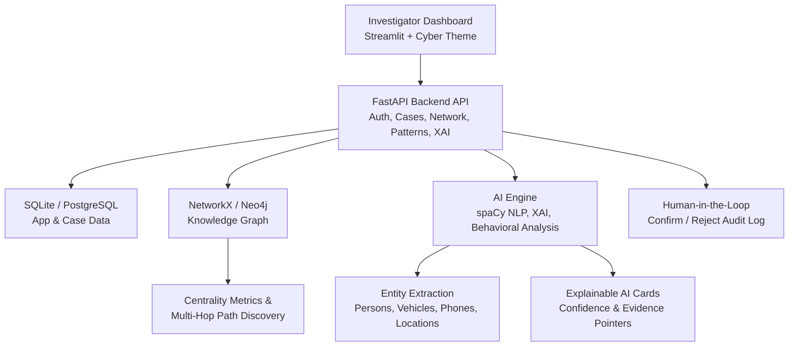

# CrimeGraph 🕸️ (AI-Powered Criminal Network Intelligence & Investigation Support System)

> **AI-Assisted Entity Extraction, Knowledge Graph Linking & Explainable Cross-Case Investigation Platform**
> **Smart India Hackathon (SIH) Prototype**

**CrimeGraph** is a browser-based investigation support platform designed to help law enforcement investigators connect fragmented, multi-case records — Persons, Vehicles, Phones/Emails, Locations, Organizations, Events, and Transactions — into a single, explainable intelligence picture.

It automatically ingests structured and unstructured case records, extracts entities using **spaCy NLP**, builds an interactive **Knowledge Graph** (NetworkX / Neo4j), performs **Behavioral Intelligence Pattern Detection**, calculates **Network Centrality Metrics**, uncovers **Multi-Hop Cross-Case Connections**, and renders **Explainable AI (XAI) Cards** with **Human-in-the-Loop Verification** — so every AI suggestion stays transparent and investigator-reviewed.

The system pairs a **cyber-themed Streamlit Command Center** with a **FastAPI backend**, backed by **SQLite/PostgreSQL** for case data and **NetworkX/Neo4j** for graph relationships, and is fully containerized with **Docker Compose** for one-command deployment.

---

## ⚖️ Ethical Boundary & Decision Support Architecture

> [!IMPORTANT]
> This system is designed strictly as an **Investigation Support & Network Intelligence Platform**.
> - ❌ Does NOT predict guilt or make automated arrest recommendations.
> - ✅ Highlights evidence-backed patterns, cross-case linkages, and network anomalies for investigator review.
> - ✅ Maintains role-based audit trails for full accountability.

---

## 🏗️ System Architecture



---

## ✨ Features

* 🧠 **Automated Entity Extraction:** Ingests structured and unstructured case records and extracts Persons, Vehicles, Phone/Email identifiers, Locations, Organizations, Events, and Transactions using spaCy NLP.
* 🕸️ **Interactive Knowledge Graph:** Builds a live, explorable network graph of every entity and relationship using NetworkX, with optional Neo4j backing for large-scale graph queries.
* 🔗 **Multi-Hop Cross-Case Discovery:** Uncovers hidden connections between entities across independent case files — for example, linking two suspects through a shared vehicle and a burner phone several hops apart.
* 📊 **Network Centrality Metrics:** Calculates key graph metrics to surface the most influential or connected entities within a case network.
* 🚦 **Behavioral Intelligence Pattern Detection:** Flags recurring behavioral patterns across cases to support proactive investigation leads.
* 🔍 **Explainable AI (XAI) Cards:** Every AI-surfaced insight comes with a confidence score and evidence pointers, so investigators can see exactly *why* a connection was suggested.
* ✅ **Human-in-the-Loop Verification:** Investigators can Confirm or Reject each AI insight directly from the dashboard, with every decision written to a role-based audit log.
* 🗂️ **Case Management Console:** Centralized view for loading, tracking, and managing multiple case files (e.g. `CASE-2026-001` through `CASE-2026-021`).
* 📄 **Automated Reporting:** Generates investigation-ready PDF reports via ReportLab.
* 🔐 **Secure Authentication:** JWT-based auth (python-jose) with bcrypt password hashing (passlib) for role-based access.
* 🐳 **Dockerized Deployment:** Full `docker-compose` setup spinning up the FastAPI backend, Streamlit frontend, and an optional Neo4j graph database with a single command.
* 🧪 **Automated Verification Tests:** Pytest-based test suite validating the AI engine's extraction and pattern-detection logic.

---

## 🛠️ Technologies Used

### Backend
* **Python 3.9+ & [FastAPI](https://fastapi.tiangolo.com/)** – Asynchronous REST API for Auth, Cases, Network, Patterns, and XAI endpoints
* **[Pydantic](https://docs.pydantic.dev/) & Pydantic-Settings** – Strict request/response schema validation and configuration management
* **[Uvicorn](https://www.uvicorn.org/)** – ASGI server for the FastAPI backend
* **python-jose & passlib[bcrypt]** – JWT authentication and secure password hashing

### AI & Graph Intelligence
* **[spaCy](https://spacy.io/)** – NLP-based named entity recognition and extraction from case text
* **[NetworkX](https://networkx.org/)** – In-memory knowledge graph construction, centrality metrics, and multi-hop path discovery
* **[Neo4j](https://neo4j.com/)** *(optional)* – Scalable graph database backend for larger deployments
* **[Scikit-Learn](https://scikit-learn.org/)** – Behavioral pattern detection and classification support
* **[Pyvis](https://pyvis.readthedocs.io/) & [Plotly](https://plotly.com/python/)** – Interactive network graph and analytics visualizations

### Frontend
* **[Streamlit](https://streamlit.io/)** – Cyber-themed Investigator Command Center dashboard (dark theme, cyan accent, custom config in `.streamlit/config.toml`)

### Data & Reporting
* **SQLite / PostgreSQL** – Relational storage for cases, entities, relationships, audit logs, and reviews
* **[ReportLab](https://www.reportlab.com/)** – Automated PDF investigation report generation

### DevOps
* **Docker & Docker Compose** – Multi-container orchestration for backend, frontend, and Neo4j services
* **Pytest** – Automated test suite for the AI engine

---

## 📂 Project Structure

```text
criminal_network_intelligence/
│
├── backend/
│   └── main.py                # FastAPI app — Auth, Cases, Network, Patterns & XAI endpoints
│
├── frontend/
│   └── app.py                 # Streamlit Investigator Command Center dashboard
│
├── tests/
│   └── test_ai_engine.py      # Pytest suite validating extraction & pattern detection
│
├── .streamlit/
│   └── config.toml            # Cyber dark theme configuration
│
├── criminal_intelligence.db   # SQLite database (cases, entities, relationships, audit_logs, reviews)
├── docker-compose.yml         # Backend + Frontend + Neo4j container orchestration
├── requirements.txt           # Python dependencies (FastAPI, spaCy, NetworkX, Streamlit, etc.)
└── README.md                  # Project documentation
```

---

## 🗃️ Database Schema

The SQLite/PostgreSQL layer tracks five core tables:

| Table | Purpose |
|---|---|
| `cases` | Case ID, title, crime type, date, location, summary, status, assigned officer |
| `entities` | Entity ID, name, type (Person/Vehicle/Phone/etc.), details, associated cases |
| `relationships` | Source/target entity links, relationship type, confidence score, case ID, evidence reference |
| `audit_logs` | Timestamped log of user, action, and details for full accountability |
| `reviews` | Investigator Confirm/Reject decisions on AI-generated insights |

---

## 🚀 Installation & How to Run

### 1. Clone the Repository
```bash
git clone https://github.com/Madhumitha42/AI-Powered-Criminal-Network-Intelligence-System.git
cd AI-Powered-Criminal-Network-Intelligence-System
```

### 2. Install Dependencies
```bash
pip install -r requirements.txt
python -m spacy download en_core_web_sm
```

### 3. Run the FastAPI Backend
```bash
uvicorn backend.main:app --reload --port 8000
```
- API Documentation: `http://localhost:8000/docs`

### 4. Run the Streamlit Frontend Command Center
```bash
streamlit run frontend/app.py
```
- Frontend UI: `http://localhost:8501`

### 5. Run with Docker Compose (Alternative)
```bash
docker-compose up --build
```
This spins up the backend (`:8000`), frontend (`:8501`), and an optional Neo4j graph database (`:7474` / `:7687`) in one step.

### 6. Run Automated Verification Tests
```bash
pytest tests/test_ai_engine.py -v
```

---

## 🎬 Demo Storyline (Multi-Hop Cross-Case Discovery)

During a live demonstration:
1. Open **Case Management** and load `CASE-2026-001` through `CASE-2026-021`.
2. Open **Network Explorer** and click **Discover Path** between `P-101 (Ravi Kumar)` and `P-103 (Arun Sharma)`.
3. The system uncovers a hidden 4-step cross-case link:
   `Ravi Kumar (P-101)` ➔ `Vehicle MH-02-AB-9901 (V-101)` ➔ `Alias Kumar (P-102)` ➔ `Burner Phone +91-9876543210 (C-101)` ➔ `Arun Sharma (P-103)`.
4. Open the **AI Insights (XAI)** card to see the evidence pointers and confidence breakdown, then use **Confirm / Reject** to log the investigator's decision to the audit trail.

---

## 💻 Modules

1. **Case Management Module** – Load, track, and manage multi-case investigation records.
2. **Entity Extraction Module** – spaCy-powered NLP extraction of people, vehicles, contacts, and locations from raw case text.
3. **Knowledge Graph Module** – Interactive NetworkX/Neo4j graph of all entities and relationships.
4. **Network Explorer Module** – Multi-hop path discovery between any two entities across cases.
5. **Behavioral Pattern Detection Module** – Surfaces recurring behavioral patterns across the case network.
6. **Explainable AI (XAI) Module** – Confidence-scored insight cards with evidence pointers.
7. **Human-in-the-Loop Review Module** – Investigator Confirm/Reject workflow with full audit logging.
8. **Reporting Module** – Automated PDF investigation report generation via ReportLab.
9. **Authentication Module** – JWT-based, role-secured investigator login.

---

## 👤 Developed By

**Madhumitha**
*Department of Computer Science and Business Systems (CSBS)*

---
## prototype 

[https://drive.google.com/drive/quota](https://drive.google.com/drive/quota)
## 📄 License
